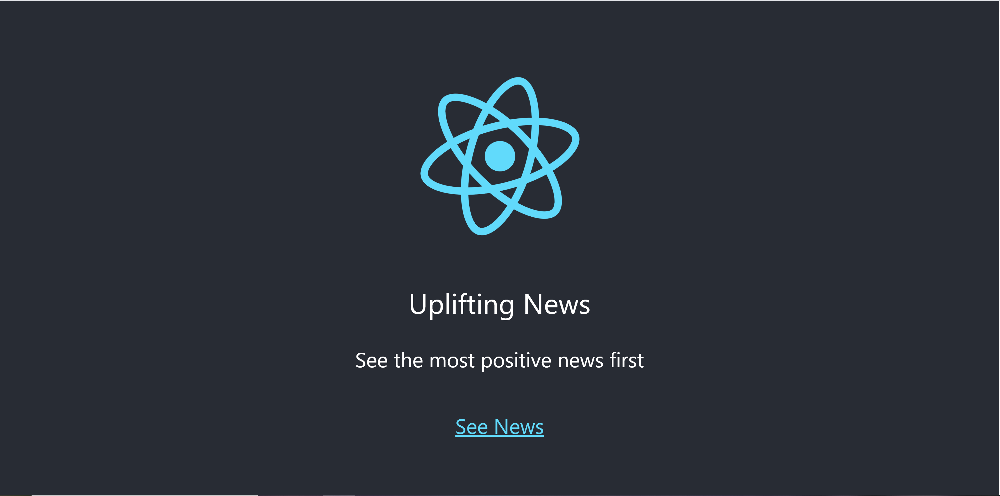
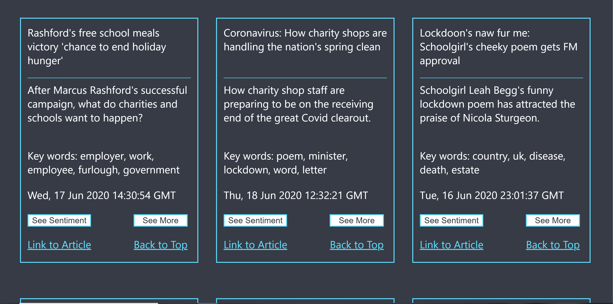
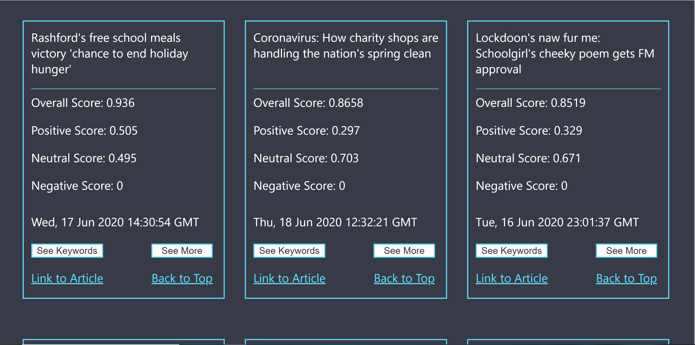

# Uplifting News

React application which uses Python to scrape news articles, performing sentiment analysis to measure positivity and topic modelling to extract keywords.

The application is hosted at [https://uplifting-news.web.app/](https://uplifting-news.web.app/) by Firebase.

## Features

Scrapes the contents of RSS feeds of various news sources. Sorts articles by positivity for display.




Measures the positivity of news articles by training a recurrent neural network (RNN).




Extracts keywords of each article using Latent Dirichlet Allocation to perform topic modelling. 




The Python code for scraping can be found at [src/scraper](src/scraper). The main file is [src/scraper/scraper.py](src/scraper/scraper.py).

The Python code for sentiment analysis and topic modelling can be found at [src/sentiment](src/sentiment). The main file is [src/sentiment/sentiment.py](src/sentiment/sentiment.py).

## Getting Started

These instructions will get you a copy of the project up and running on your local machine.

### Prerequisites

The following tools are required.

1. npm is needed for installation and can be downloaded [here](https://nodejs.org/en/).

2. Python must be installed, along with the following libraries.
    * Feedparser
    * Requests
    * BeautifulSoup
    * pandas
    * TensorFlow
    * Scikit-learn

    These can be installed using ```pip install library-name```.

### Running

How to run the application

1. Clone the repository.
2. Run ```npm install``` to build the necessary modules.
3. Run ```npm start``` to access the application at [http://localhost:3000/](http://localhost:3000/).

To update the news feed

1. Navigate to the /src/display folder with ```cd src/display```
2. Run display.sh with ```./display.sh```. This will execute both python scripts to scrape new articles and perform sentiment analysis and topic modelling.

## Built With

* [React](https://reactjs.org/) - Front-End User Interface
* [TensorFlow]https://www.tensorflow.org/) - Deep Learning Sentiment Analysis
* [LDA (Latent Dirichlet Allocation)](https://scikit-learn.org/stable/modules/generated/sklearn.decomposition.LatentDirichletAllocation.html) - Topic Modelling

## License

This project is licensed under the MIT License - see [LICENSE](LICENSE) file for details.
